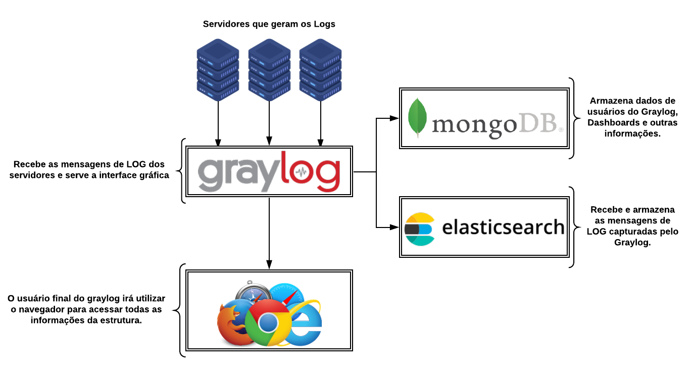

## Configuração do GrayLog no Ubuntu 20.04.

🦸‍♂️ O Graylog é uma ferramenta Open Source utilizada para centralizar, ordenar e classificar os logs afim de  analisar os logs de sua infraestrutura de maneira eficiente, direcionando assim todos os logs dos diversos ativos para um único host, facilitando uma auditoria, o monitoramento e a identificação de algum problema.

## 🛠 Tecnologias

As seguintes ferramentas foram usadas neste projeto:

- [Graylog Server][Faz a análise e coleta dos logs e os envia para   ElasticSearch Server]
- [Graylog Web][A interface para o Graylog Server]
- [MongoDB][Responsável pelo armazenamento das configurações e metadados]
- [Elastic-search][Armazena os logs e é responsável pelas buscas]

## 🚀 Intalações e configurações do ambiente

💡A maquina virtual disponibilizada no AWS tem as seguintes configurações de acesso: 

Ubuntu 20.04.2 64 Bits

DNS de acesso externo: desafio.aquare.la

IP de acesso externo: 23.23.91.114

Usuário ubuntu, acesso via SSH.

OBS: O IP da máquina virtual (interno) é o 10.0.0.12 

# Acessando o ambiente via terminal bash
`$ ssh ubuntu@desafio.aquare.la`

# Instalando as ferramentas necessárias
`$ sudo apt-get update`

`$ sudo  apt-get upgrade`

*Abstração dos pacotes de software para o APT*

`$ sudo apt install software-properties-common` 

*Para chamadas HTTP de testes*

`$ sudo apt install curl`

*Para instalar pacotes .deb*

`$ sudo apt install gdebi`

*Para editar textos via terminal*

`$ sudo apt install vim`

*Para baixar arquivos da internet*

`$ sudo apt install wget`

*Para verificar conexões de rede*

`$ sudo apt install net-tools`

*Para uso de repositórios https no arquivo sources.list: acessar os metadados e pacotes disponíveis em repositórios que usam o HTTPS. Dependencia do GrayLog*

`$ sudo apt install apt-transport-https` 

*Para para criar identificadores exclusivos para os registros. Dependencia do GrayLog*

`$ sudo apt install uuid-runtime`

*Para gerar uma senha e posteriormente configurar a linha password_secret do GrayLog server. Dependencia do GrayLog*

`$ sudo apt install pwgen`

*Para importar a chave de assinatura de um repositório*

`$ sudo apt install dirmngr`

*Para instalar Java Runtime Environment (JRE). Dependencia do GrayLog*

`$ sudo apt install openjdk-8-jre-headless`

# Instalando o ElasticSearch
*Para baixar de forma segura e adicionar a chave Elasticsearch GPG*

`$ wget -qO - https://artifacts.elastic.co/GPG-KEY-elasticsearch | sudo apt-key add -`

*Para adicionar o repositório de pacotes do elasticsearch na pasta do apt*

`$ echo "deb https://artifacts.elastic.co/packages/6.x/apt stable main" | sudo tee -a /etc/apt/sources.list.d/elastic-6.x.list`

*Para atualizar repositório e instalar o Elasticsearch*

`$ sudo apt update` 

`$ sudo  apt install -y elasticsearch`

# Configurando o ElasticSearch
*Para alterar arquivo de configuração do Elasticsearch (cluster.name: graylog)*

`$ sudo vi /etc/elasticsearch/elasticsearch.yml`

*Para iniciar o serviço na inicialização do sistema*

`$ sudo systemctl enable elasticsearch`

*Para reiniciar o serviço*

`$ sudo systemctl restart elasticsearch` 

*Para verificar o serviço*

`$ sudo systemctl status elasticsearch`

`$ sudo curl -XGET 'http://127.0.0.1:9200/_cluster/health?pretty=true'`

# Instalando o MongoDB
*Para adicionar a chave MongoDB GPG (Chave 68818C72E52529D4 como confiável)*

`$ sudo apt-key adv --keyserver hkp://keyserver.ubuntu.com:80 --recv 68818C72E52529D4`

*Para adicionar o repositório de pacotes do MongoDB na pasta do apt*

`echo "deb http://repo.mongodb.org/apt/ubuntu bionic/mongodb-org/4.0 multiverse" | sudo tee /etc/apt/sources.list.d/mongodb-org-4.0.list`

*Para atualizar repositório e instalar o MongoDB*

`$ sudo apt update` 

`$ sudo apt install -y mongodb-org`

# Configurando o MongoDB
*Para iniciar o serviço na inicialização do sistema*

`$ sudo systemctl enable mongod`

*Para iniciar o serviço*

`$ sudo systemctl start mongod`

# Instalando o GrayLog
*Para baixar o pacote do repositório GrayLog*

`$ sudo wget https://packages.graylog2.org/repo/packages/graylog-3.0-repository_latest.deb`

*Para instalar o pacote .deb*

`$ sudo gdebi graylog-3.0-repository_latest.deb`

*Para atualizar repositório e instalar o GrayLog*

`$ sudo apt update` 

`$ sudo apt install graylog-server -y`

# Configurando o GrayLog
*Para gerar uma senha segredo para criptografia. O resultado foi: 5TfC5NbDeLjd750UqAL83apb1FgkUzkrFEnq2OzKTb7kKWdsZ8QlEI4aTdQnb9pl9aj2MbfUCCBrgDdBQr6ol1ZH0IEah5mL*

`$ sudo pwgen -N 1 -s 96`

*Para gerar o hash SHA-256 da senha de acesso pela interface web. Defini para o usuário "admin" a senha "suasenha".  O resultado foi: 9872c134f90411596496d8ffe4d724f18aa20647473c8023fbc94a61f3726d3c*

`$ sudo echo -n suasenha | sha256sum`

*Ajustar a seguintes linhas do arquivo /etc/graylog/server/server.conf:*

password_secret = 5TfC5NbDeLjd750UqAL83apb1FgkUzkrFEnq2OzKTb7kKWdsZ8QlEI4aTdQnb9pl9aj2MbfUCCBrgDdBQr6ol1ZH0IEah5mL (Valor retornado pelo PWGEN)

root_password_sha2 = 9872c134f90411596496d8ffe4d724f18aa20647473c8023fbc94a61f3726d3c (Valor do hash SGA-256 para a senha de acesso que foi definida)

root_email = "murilocaldeira@hotmal.com"

root_timezone = UTC (Pode-se ajustar ao diferentes horários)

is_master = true (Definir como servidor principal. Utilizado quando se tiver mais de um GrayLog server em um cluster)

elasticsearch_shards = 1 (O shard é a unidade em que o Elasticsearch distribui dados em torno do cluster. Para o desafio defini apenas 1)

elasticsearch_replicas = 0 (As réplicas são cópias dos shards e fornecem confiabilidade se um nó for perdido. Para o desafio optei por não ter réplicas)

http_bind_address = 10.0.0.12:9000 (A interface de rede usada pelo Graylog. É o próprio servidor Ubuntu)

http_publish_uri = http://desafio.aquare.la:9000 (O endereço HTTP deve ser acessível a todos que usam a interface Web. Isso significa que Graylog Web deve estar diponível em um rede pública, para acesso externo, podendo ser proxy, NAT ou um load balancer. (É o DNS de acesso externo do servidor Ubuntu)

*Para alterar arquivo de configuração do GrayLog*

`$ sudo vi /etc/graylog/server/server.conf`

*Para iniciar o serviço na inicialização do sistema*

`$ sudo systemctl enable graylog-server` 

*Para iniciar o serviço*

`$ sudo systemctl start graylog-server` 

*Para verificar o status do serviço*

`$ sudo systemctl status graylog-server`

*Para verificar os logs do GrayLog*

`$ sudo tail /var/log/graylog-server/server.log`

*Para verificar as conexões de rede*

`$ sudo netstat -tlpn`

*Testes chamando API Web*

`$ sudo curl -XGET 'http://10.0.0.12:9000`

# Configurando o servidor de envio de Logs
*Utilizei o rsyslog do Ubuntu como exemplo. Para isso foi preciso alterar o arquivo /etc/rsyslog.d/50-default.conf, adicionando a linha* 

**.* *    @@10.0.0.12:12201

*para encaminhar para o servidor GrayLog, na porta do input que será configurado, os logs do rsyslog do servidor linux. (@@ significa encaminhar por TCP)*

*Para reiniciar o serviço rsyslog*

`$ sudo service rsyslog restart`

# Acessando o GrayLog Web e Configurando o Input 
*No navegador WEB, acessar http://desafio.aquare.la:9000/*

*Para configurar um novo Input, no graylog web, system->input->syslog tcp->launch, Syslog TCP, configurar porta do input para 12201*

# Testando o envio de logs
*Utilizei o comando logger no terminal para gerar o log, encaminhar e exibir no graylog*

`$ logger "Está funcionando o envio de logs"`

`$ logger "Exemplo de envio de log do rsyslog para o GrayLog"`